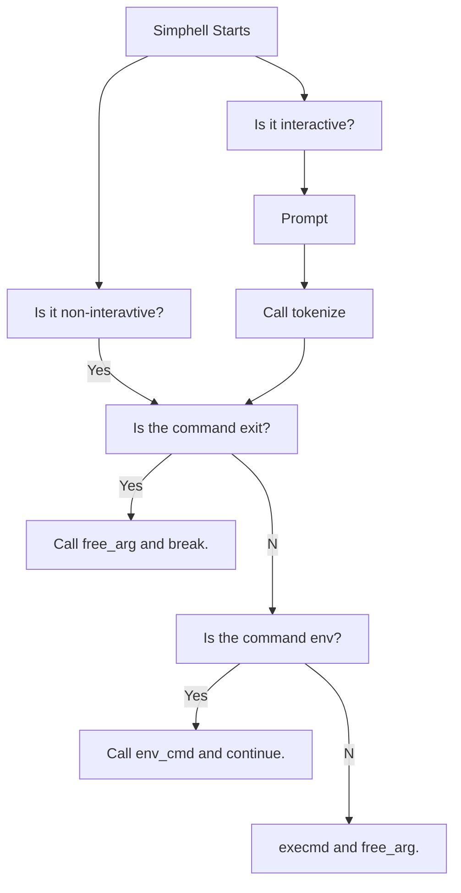
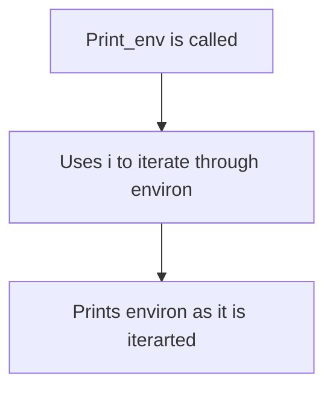
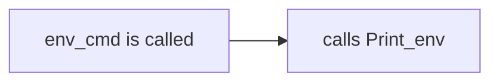
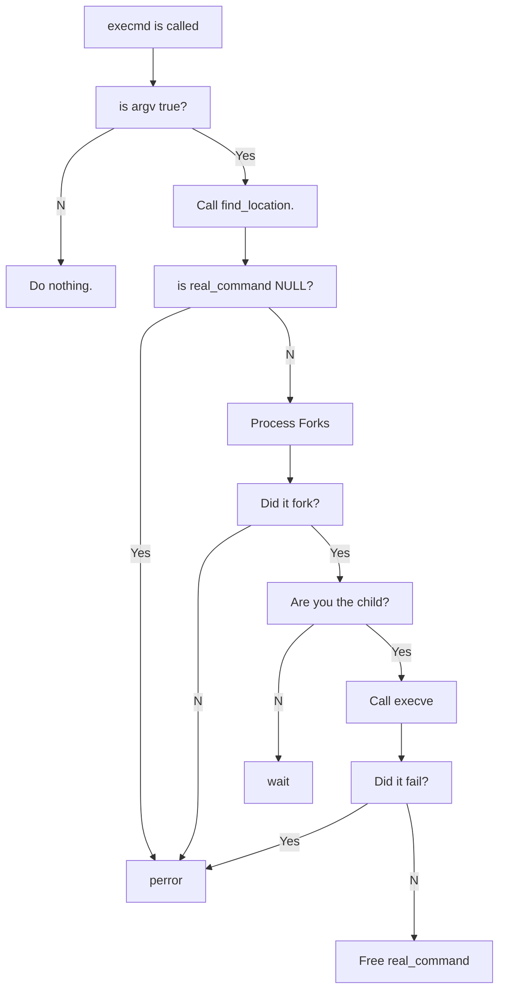
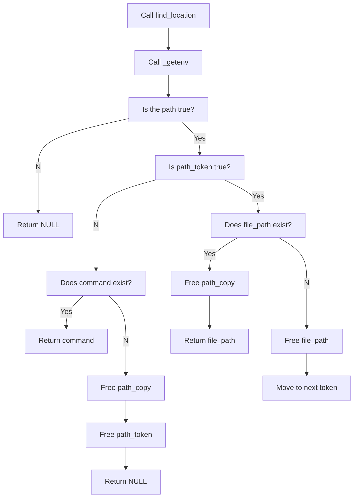
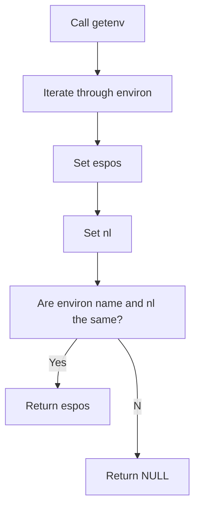

#**Project**'Simple Shell'

## Introduction
> This README is for the simple shell project at Holberton. It countains the requirements, allowed functions and system calls, prototypes, compiler used, and a list of files.

### Requirements
- Allowed editors: vi, vim, emacs
- All your files will be compiled on Ubuntu 20.04 LTS
- Your code should use the Betty style.
- Shell should not have memory leaks
- No more than 5 functions per file
- Header files should be include guarded
- Only use system calls when needed

### Allowed Functions and System Calls
- access
- chdir
- close
- closedir
- execve
- exit
- _exit
- fflush
- fork
- free
- getcwd
- getline
- getpid
- isatty
- kill
- malloc
- open
- opendir
- perror
- printf
- fprintf
- vprintf
- sprintf
- putchar
- read
- readdir
- signal
- stat (_xstat)
- lstat (_lxstat)
- fstat (_fxstat)
- strtok
- wait
- waitpd
- wait3
- wait4
- write

##### Prototypes
- int main(int argc, char **argv)
- void free_arg(char **argv)
- char *_getenv(const char *command)
- void execmd(char **argv)
- char *find_location(char *command)
- char **tokenize(char *input, const char *delim)
- void print_env(void)
- void env_cmd(void)

##### Compilation
`gcc -Wall -Werror -Wextra -pedantic -std=gnu89 *.c -o hsh'

### Repo Files
| **File** | *__Description__* |
|----------|----------------:|
|AUTHORS| File containing all Contributors to the Repo|
|man_1_simple_shell|Man page for the simphell function|
|main.h|Header file containing all structs and prototypes used|
|simphell.c| File that contains the main function for creating a shell and the free_args function to free variable arg|
|tokenize.c|Reads the input and breaks it down into tokens|
|print_env.c| Contains the function for printing the environment|
|execmd.c| Contains the execmd function that forks the process and runs a command|
|find_location.c| Contains the function for finding the environment path of a command and checking that the command exists|
|_getenv| Finds the PATH variable from the environment|

### Flow charts

#### Simphell



#### Print_env





#### execmd



#### find_location



#### _getenv



#### tokenize

```mermaid
flowchart TD;
  A[Tokenize is called]-->B[c_read set to getline];
  B-->C[Is c_read -1?];
  C--Yes-->D[Free input];
  D-->E[Exit];
  C--No-->F[Allocate memory for input_copy];
  F-->G[Was memory Allocated?];
  G--No-->H[perror];
  G--Yes-->I[Make Tokens from input];
  I-->J[While Token is true];
  J-->K[Added to token count];
  K-->L[Allocate memory for Tokens];
  L-->M[Iterate through argv];
  M-->N[Copy Tokens to argv[i]];
  N-->O[Free input and copy];
  O-->P[Return argv];
```
